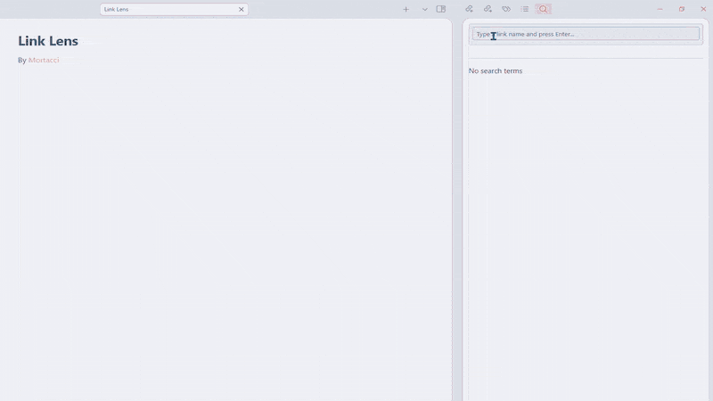

# Link Lens
Plugin for Obsidian inspired by the backlinks filters in Roam Research. You can search for all the blocks that contain a specific `[[link]]`, and then you can filter the research by property value or by adding or removing suggested `[[links]]` contained in the results.

## How to install
Download the following files:
- main.js
- style.css
- manifest.json
- versions.json

1. And paste them inside in this path: `[YOUR VAULT]\.obsidian\plugins\linklens`.
2. Go to `Settings > Community plugins` and activate Link Lens.
 

## How it works
Launch the plugin by opening the command palette via `CTRL+P` and select `Link Lens: Open Search Panel` (or assign a hotkey to it). By typing in the search bar, all existing and non-existing[^1] links in your vault will be suggested according to what you write (it works with aliases, too). You can select one with the arrows and press Enter, or simply click it on the list. The plugin shows all the blocks that contain that link. Additionally, it shows two things:
- Related links: all the other links that are contained in the blocks found
  - If you click on one of the Related links, it will be added to the search terms. So the new results will be the blocks that contain the selected links. On the contrary, if you click on one search term, it will be removed from the search terms.
- All the properties that are contained in the notes to which the blocks found belong
  - If you click on one property, it opens up a dropdown list that contains all the values that that property assumes in the notes found. If you click on one value, the search will be filtered and it will preview only the blocks that pertains to the notes with a property that has that specific value. For example, you can search for all the blocks that contains the link `[[link]]` and that at the same time belong to all the notes in which the property `author` is "me".
  
If you search for a search term which is not a note (I'll call it non-note) that search is interpreted as a simple regex search. The corresponding search term button is square-shaped to remind you of the difference.

In the block previews if you click 📋 you can copy the content of the block, while if you click 🔗 you will be redirected to the selected block.

[^1]: By "non-existing link" I mean a link that sends to a note that has not been created yet.

### Logic operators
Be aware that you can personalize the search logic:
- every time that you click or press Enter you are adding a search term with an `AND` operator
- If you Shift + click (or Enter) you add a search term with an `OR` operator
  - The first term with `OR` operator is ignored because it's nosense to search only one. A popup will remind you this
- If you Ctrl + Shift + click (or Enter) you add a search term with a `NOT` operator

### Block parsing logic
In order to define a block, the plugin searches for the following section types (`SectionCache.type`):
- `paragraph` - regular text paragraphs
- `table` - entire markdown tables
- `list` - list items. It finds all the individual list items within that section using `cache.listItems` and processes each list item separately
- `footnoteDefinition` - footnotes
- `callout` - callout blocks

The actual search is made by the function `findLinkedBlocksForMultiple()`.

# Vibe coding warning
This code has been created mainly with AI because I'm not able to code. Before refactoring [Difonzo](https://github.com/Difonzo) introduced some features (like the refresh button and the slicer for notes with too long titles) and improved UI, but navigating the code was very difficult.
Version 0.0.2 has been refactored (by the AI, obviously...) but the code is still very long.
Version 0.0.2 has also been checked with DeepSeek against [Obsidian plugin guidelines](https://docs.obsidian.md/Plugins/Releasing/Plugin+guidelines) by sending each time a single guideline and the full code and css file.

## Other functions that can be introduced:
- Add the possibility to search for tags (they should be suggested in the search bar). I don't use tags so much in my note-taking workflow, so I didn't implement this in this version.
- Add a command to open the search panel with the current note already selected as search term (and start the research).

## Known issues
- Pressing Ctrl + Shift + Enter after writing a non-note doesn't add it with NOT operator
- By default, the search ignores the first search terms which is assigned to OR (wating to have at least a second term). However, if the first absolute term searched is searched through OR a search will be performed anyway (I think that it simply show every result possible).
- [[wikilinks]] inside a previewed block are not clickable.
- Footnotes are not previewed correctly.
- highlightEditorBlock doesn't work (after pressing the link icon, it should highlight the related block in the Editor for 3 seconds)
The fact that I know these issues doesn't mean that I know how to solve them. Whoever wants to help is welcome 
- - - - - - - - - - - - - - - - - - - - - - - - - - - - - - - - - - - - - - - - - - 
